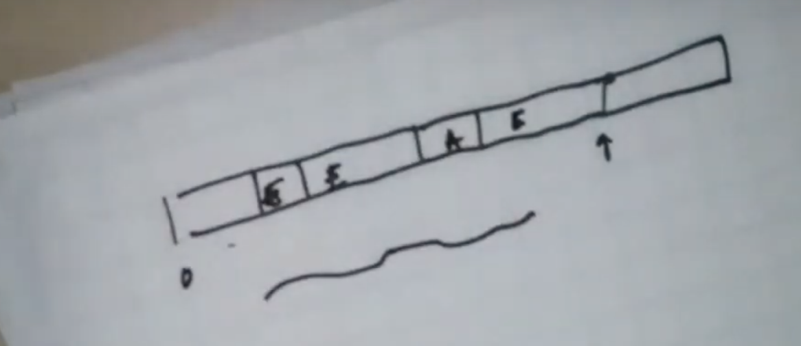
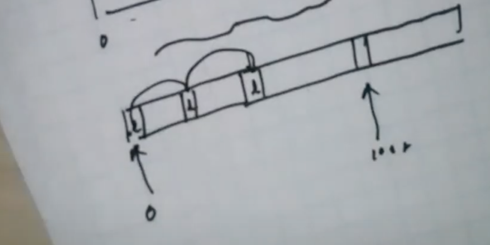

# Step1
## a. Collect functional requirement 
- publish message to system, multiple publisher
- Consume message from system, multiple consumer
    - Consume message for given message Id
- Do not loose message, persistence
- Retention
- Ordering guarantee
- Realtime performance
- Throughput
- Resending failed messages exactly once or at least once semantics

## b. Collect design constraints

# Step 2
## a. Bucketize functional requirements into micro services
- A single service
- App server tier just to serve stats
- Everything happened in protocol therefore no app server is needed here
Following would be service components
1. persistence tier
2. App server tier to server stats
## b. Get clarity weather problem is breadth-oriented or depth-oriented
- Depth
# Step 3
## a. Draw a logical diagram
## b. Draw and explain data/logic flow between them
### Logical design for storage layer
Data model: 
MessageId as key: Message body as value V
### How to store in persistence layer?
- Store messages into append only log, and then keep and index of <messageId, location in log>
- Retention period by default 7 days
- Log emulates a ring buffer. There is no hole so purging is easy. You can do file level truncate.

- Kafka uses skip list

This introduce some latency, but save storage.
- Since there is no whole so you can call for truncate on file for given range for cleanup

### How to manage sorted order?
- Already written in log in sorted order.
- Given a message if consumer is asking for same message Id, it will see message more than once. 
- Kafka also manages if consumer already reads that messages or not
- If Kafka gets ack for that consumer then it will not be send again to same consumer
- If Kafka doesn't get ack, then Kafka will send same message again
- Kafka creates partition index for each consumer
- As a producer, if I don't get ack from Kafka then I will have to resend it
- This will create two messages with same content
- Consumer has to manage duplicates
- Producer have to maintain the sequence number/id in message to help consumer to handle duplicate
# Step 4:
## b. Each micro services consists of one of more tiers
Why distributed?
1. Storage
2. Throughput
3. Availability
4. Geo location
5. Latency 
- Writing at the end of the files is fastest form of write, bcz spindle doesn't have to move
- In today's world, you will never design a system which will do update. This is to avoid cost to update. Also, ssd is not friendly for update.
- You treat your updates as insert
- Storage engine runs compaction to merge old data
- This concept is called, `append only writes`

## c. Build scalable system
### Sharding
- K: V : Body storing as a single log
- Kafka does horizontal sharding
    - <Topic, Partition within a topic, msgid >, body
    - Every topic and partition become a separate log
    For example,  `Obama` with `4000` partition will create `4000` files as `Obama-1`, `Obama-2` .... `Obama-4000`
    - create_topic(Wimbledon, 1024)
    - send(Wimbledon, partitionId, message body)
    - `partitionId` is optional, if not provided then it will be chosen randomly.
    - Order is guaranteed within partition
    - Consumer has to handle k merge approach on sorted data
    - To scale log, you build multiple logs
    - Kafka doesn't do vertical partition
    - If topic is hot then it may grow big,
    - There are some third parties which can do vertical partition as well.
    - Consumer polls in infinite loop, it will start with offset
    - Kafka will gives 500 messages in single poll
    - 100 to 600 in first poll, then 600 to 1100 in next poll
    - If system needs strict ordering then you have to go with one partition
- Commit logic. 
    - Consumer keep track of what they consumed. 
    - It keep track of messageID. 
    - If consumer dies then consumer will put needle back to messageId
    - Typically Consumer keeps track of messages it reads
## Consumer Groups

- Consumers belongs to same group share a group Id
- The consumers in a group then divides topic partitions as fairly among themselves as possible by establishing each partition is only consumed by a single consumer from that group
- Messages are broadcasted to all consumer groups
- Ideally, the number of partitions is equal to the number of consumers
- If the number of consumers be greater, the excess consumers are idle, wasting client resources. 
-  If the number of partitions is greater, some consumers will read from multiple partitions which should not be an issue unless the ordering of messages is important to the use case.

